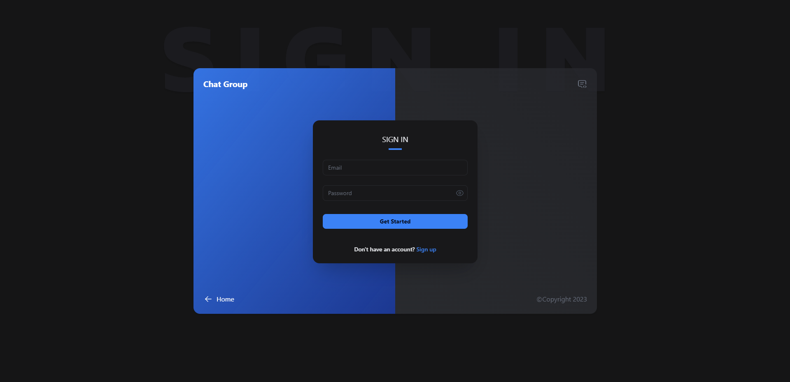
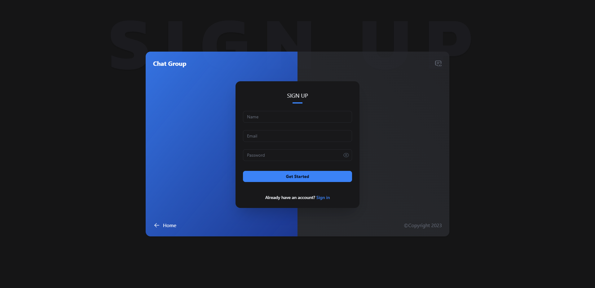
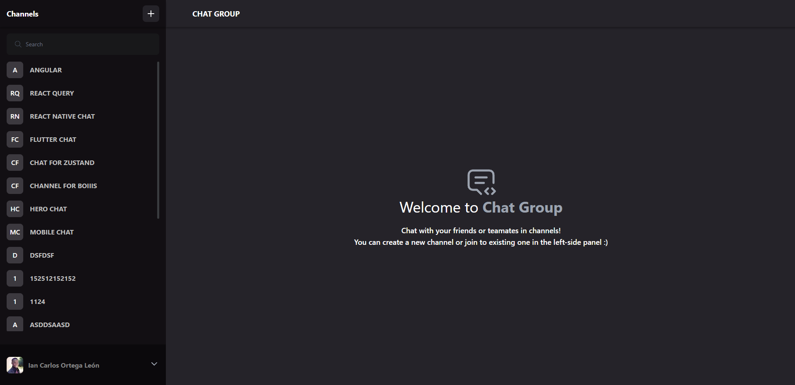
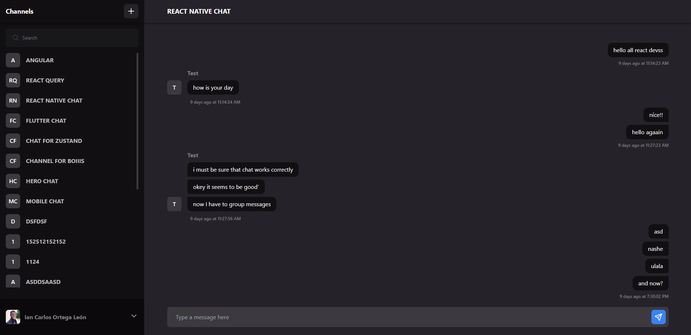
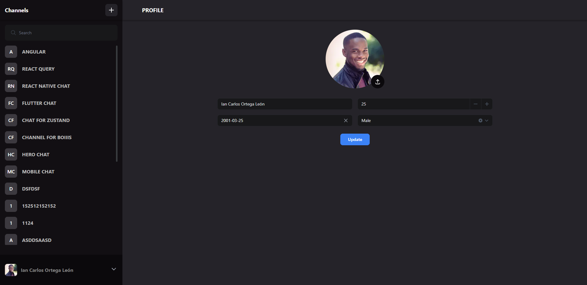
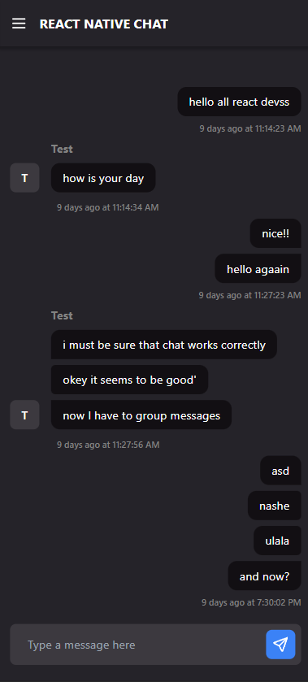
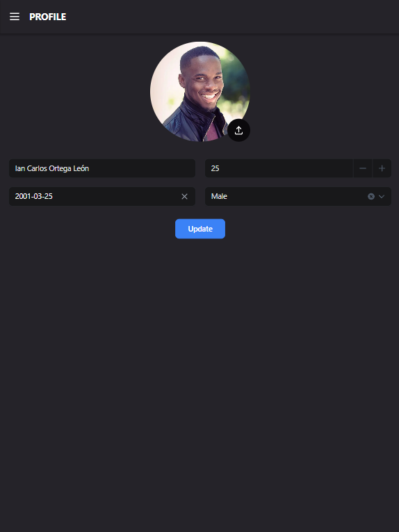

# Thrullo

## Description

Web application designed to revolutionize your communication experience with real-time messaging. Whether you're collaborating with team members or connecting with friends.

## Tech Stack

- TypeScript
- Next.Js 13
- TailwindCSS
- Zustand

## User stories

- I can sign up and login with email and password
- I can login with social media accounts
- I can create multiple chats
- I can join to any chat
- I can send messages to all the members online in the chat
- I can see other people's messages in realtime
- Infinite Scroll for messages and chats
- I can search for groups
- I can upload my profile
- I can see the app in different screen sizes

## Development environment setup

- Raise the backend following the steps from [Chat Group API](https://github.com/iancarlosortega/chat-group-api)
- Clone the repository `git clone https://github.com/iancarlosortega/chat-group.git`
- Install dependencies by running `npm install`
- Copy `.env.template` and rename to `.env.local` file and add the environment variables
- Run `npm run dev` to start the development server

## User to test app

- Visit [Chat Group](https://chat-group-phi.vercel.app/) to use the app
- Use the following credentials to login
  - Email: **test@gmail.com**
  - Password: **$Asdf123**

## Screenshots

